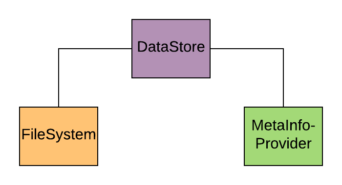
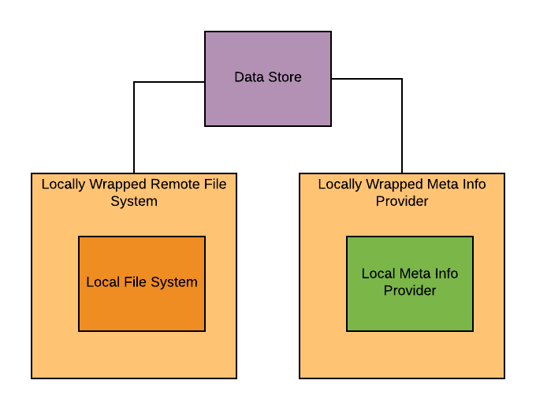

==============
Basic Concepts
==============

Basically, the Data Access Component administrates several Data Stores.
A Data Store is a unit that provides access to data of a certain type.
It consists of a FileSystem and a MetaInfoProvider.
The FileSystem accesses the actual data, the MetaInfoProvider has information on the available data.

This separation has been undertaken so that queries can be performed quickly on the MetaInfoProvider without having to
browse through the FileSystem which might be costly.
Queries on the availability of data for a given data type, spatial region,
and in a certain time range will be addressed to the MetaInfoProvider.
Such information will be retrieved in the form of a ``DataSetMetaInfo`` object.
This is a simple data storage object which provides information about the data type, spatial coverage, start time and
end time of a dataset.

The File System will be addressed when actual URL's are requested.
Such a request might result in costly operations, such as downloads.

Some of the Data Stores access data that is stored remotely.
To make it accessible to the other components of the MULTIPLY platform it needs to be downloaded and
added to a local data store.
These remote data stores are "wrapped" by a local data store, so the result is a store that has a remote File System,
a local File System, a remote Meta Info Provider and a local Meta Info Provider.

If a query is made for data, the Data Store will search first in the local, then in the remote Meta Info Provider.
Results from the remote Meta Info Provider that are already contained in the local Meta Info Provider
will not be considered.
When then the data is actually requested, it is either simply retrieved from the local File System or,
if it is provided on the remote File System, downloaded from there into a temporary directory.
It is then put into the local File System and the local Meta Info Provider is updated
with the information about the newly added data.

The following forms of FileSystems and MetaInfoProviders exist:

File Systems:

- LocalFileSystem: Provides access to locally stored data. Applicable to any data type, this is the default for local meta info provision.
- HttpFileSystem: A locally wrapped file system that retrieves data via http. Applicable to any data type.
- AWSS2FileSystem: A locally wrapped file system that retrieves S2 data in the AWS format from the Amazon Web Services. This File System requires that users are registered at the AWS.
- LpDaacFileSystem: A locally wrapped file system that retrieves MODIS MCD43A1.006 data from the Land Processes Distributed Active Archive Center. This File System requires that users have an Earthdata Login.
- VrtFileSystem: A locally wrapped file system that downloads data sets of a given type, a certain spatial region and no temporal information. It combines these data sets into a single global `.vrt-file <https://www.gdal.org/gdal_vrttut.html>`_ which references the downloaded data sets. This is useful for ,e.g., having elevation data.

Meta Info Providers:

- JsonMetaInfoProvider: A local meta info provider that stores relevant information (spatial coverage, start time, end time, data type) about a data set in a JSON file. Applicable to any data type, this is the default for local meta information provision.
- HttpMetaInfoProvider: A locally wrapped meta info provider that provides meta information about data sets that can be retrieved via http. Applicable for any data type.
- AwsS2MetaInfoProvider: A locally wrapped meta info provider that provides meta information about S2 data in the AWS format from the Amazon Web Services. This information can be retrieved without having an AWS account.
- LpDaacMetaInfoProvider: A locally wrapped meta info provider that provides meta information about MODIS MCD43A1.006 data from the Land Processes Distributed Active Archive Center. This File System requires that users have an Earthdata Login.
- VrtMetaInfoProvider: A locally wrapped meta info provider that provides meta information about a single global `.vrt-file <https://www.gdal.org/gdal_vrttut.html>`_ that encapsulates access to data sets from a given data type.
