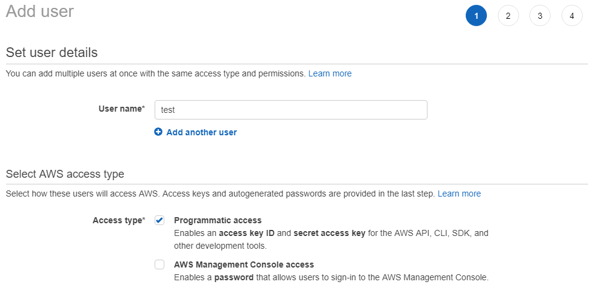
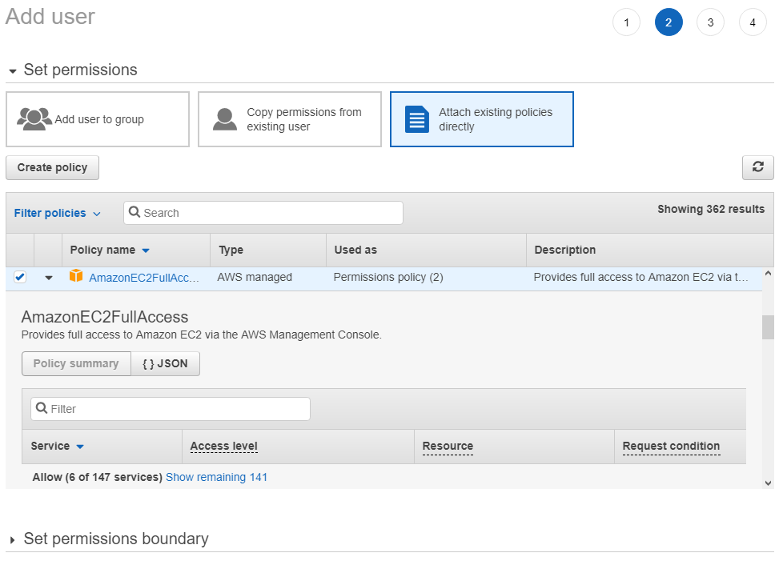

============
Installation
============

Requirements
============
The MULTIPLY Data Access Component has been developed against Python 3.6.
It cannot be guaranteed to work with previous Python versions, so we suggest using 3.6 or higher.
The DAC will attempt downloading data from remote sources.
We therefore recommend to run it on a computer which has a lot of storage (solid state disks are recommended)
and also a good internet connection.

Installing from source
======================

To install the Data Access Component, you need to clone the latest version of the MULTIPLY code from GitHub and
step into the checked out directory:

- git clone https://github.com/multiply-org/data-access.git
- cd data-access

To install the MULTIPLY Data Access into an existing Python environment just for the current user, use:

- python setup.py install --user

To install the MULTIPLY Data Access for development and for the current user, use

- python setup.py develop --user

Configuration
=============

There are a few configuration options you can make to use the DAC.
These options will be available after you use the DAC for the first time.
To use it, type in a python console:

.. code-block:: console

    $ from multiply_data_access import DataAccessComponent
    $ dac = DataAccessComponent()

When you execute this for the first time, in your home directory a folder ``.multiply`` is created,
in which you will find a file called ``data_stores.yml`` ,
which we will refer to as the data stores file in the following.
This file contains the data stores to which the DAC has access.
In the beginning, it will consist of several default entries for data stores
which are required for accessing remote data
(For an explanation of the concepts of a FileSystem and a MetaInfoProvider go to :doc:`function`).
These entries have settings that look like the following:

.. code-block:: console

    - DataStore:
        FileSystem:
            parameters:
                path: /path/to/user_home/.multiply/aws_s2/
                pattern: /dt/yy/mm/dd/
                temp_dir: /path/to/user_home/.multiply/aws_s2/temp/
            type: AwsS2FileSystem
        Id: aws_s2
        MetaInfoProvider:
            parameters:
                path_to_json_file: /path/to/user_home/.multiply/aws_s2/aws_s2_store.json
                type: AwsS2MetaInfoProvider

Consider especially the parameters ``path`` and ``pattern`` of the FileSystem.
These parameters determine where downloaded data will be saved.
``path`` determines the root path, ``pattern`` determines a pattern for adding an additional relative graph.
``dt`` stands here for the data type, ``yy`` for the year, ``mm`` for the month, and ``dd`` for the day of the month.
So, if you download S2 L1C data in the AWS format for the 26th of April, 2018,
using the above configuration it would be saved to
``/path/to/user_home/.multiply/aws_s2/aws_s2_l1c/2018/4/26/``.
Feel free to change these parameters so the data is stored where you want it.
If you point it to a folder that already contains data, make sure it conforms to the pattern so it will be detected.
If you want to add a new data store using your already locally stored data, go to :doc:`user_guide`.

Some of the data stores require authentication.
Here we will describe how to set this up the access to Sentinel-2 data from Amazon Web Services
(AWS, https://registry.opendata.aws/sentinel-2/ ) and to MODIS data
from the Land Processes Distributed Active Archive Center (LP DAAC, https://lpdaac.usgs.gov ) .

-------------------------------------------------
Configuring Access to MODIS Data from the LP DAAC
-------------------------------------------------

To access the data, you need an Earthdata Login.
If you do not have such a login, click here1_ to register.
.. _here1: https://urs.earthdata.nasa.gov/home
Registration and Data Access are free of charge.
When you have the Login data, open the data stores file and search for the Data Store with the Id ``MODIS Data``.
You will find two entries ``username`` and ``password``.
Enter there your Earthdata username and password.
The entry should then look something like this:

.. code-block:: console

    - DataStore:
        FileSystem:
            type: LpDaacFileSystem
            parameters:
            temp_dir: /path/to/user_home/.multiply/modis/
            username: earthdata_login_user_name
            password: earthdata_login_password
            path: /path/to/data/modis/
            pattern: /dt/yy/mm/dd/
        Id: MODIS Data
        MetaInfoProvider:
            type: LpDaacMetaInfoProvider
            parameters:
            path_to_json_file: /path/to/user_home/.multiply/modis/modis_store.json

Then simply save the file.

--------------------------------------------------------------
Configuring Access to Sentinel-2 Data from Amazon Web Services
--------------------------------------------------------------

First, you can enable it to download Sentinel-2 data from Amazon Web Services.
Please note that unlike the other forms of data access, this one eventually costs money.
The charge is small, though.
(see here2_).
.. _here2: https://forum.sentinel-hub.com/t/changes-of-the-access-rights-to-l1c-bucket-at-aws-public-datasets-requester-pays/172
To enable access, go to https://aws.amazon.com/free/ and sign up for a free account.
You can then log on to the `Amazon Console`__.
__ aws_console_
.. _aws_console: https://console.aws.amazon.com/console/home
From the menu items ``Services->Security, Identity and Compliance`` choose ``ÌAM``.
There, under ``Users``, you can add a new user.
Choose a user name and make sure the check box for ``Programmatic Access`` is checked.

On the next page you need to set the permissions for the user.
Choose ``Attach existing policies directly`` and check the boxes for ``AmazonEC2FullAccess`` and ``AmazonS3FullAccess``
(later you may simply choose to copy the permissions from an existing user).

When everything is correct, you can create the user.
On the next site you will be shown the access key id and a secret access key.
You can also download both in form of a .csv-file.

Next you will need to install the ``sentinelhub`` python package.
Follow the instructions from `this site`__ to do so.
__ sentinelhub_
.. _sentinelhub: https://sentinelhub-py.readthedocs.io/en/latest/install.html
Then proceed to configure sentinelhub using your AWS credentials, following the instructions from `this site`__.
__ sentinelhub_configuration_
.. _sentinelhub_configuration: https://sentinelhub-py.readthedocs.io/en/latest/configure.html

The MULTIPLY Data Access Component will then be able to access this data.

.. describing how the module can be installed (including possibly how the documentation can be rebuild).
(one can argue that maybe to put this higher up in the structure, but considering that this is only done once,
I thought it better to put it lower in the documentation).